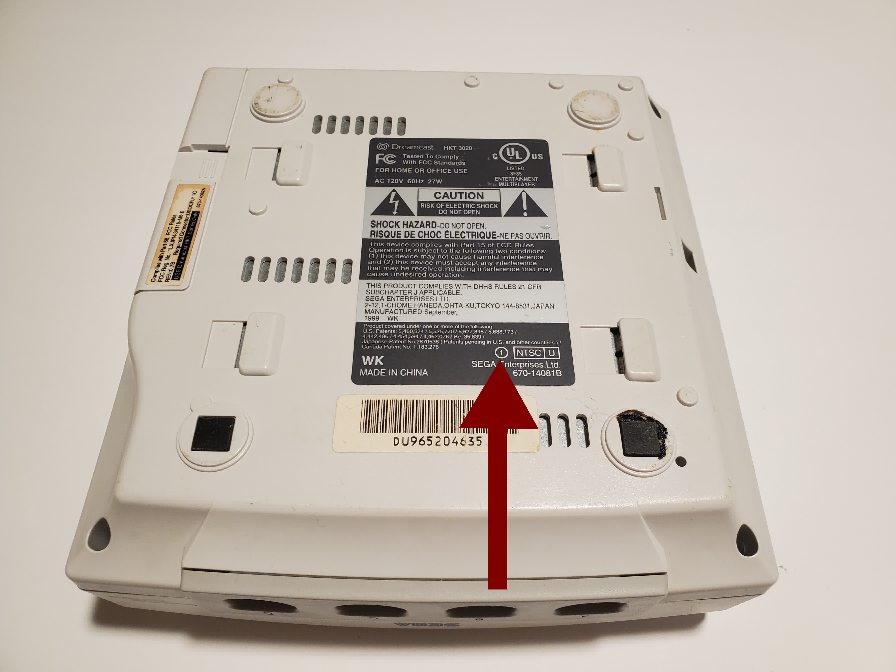
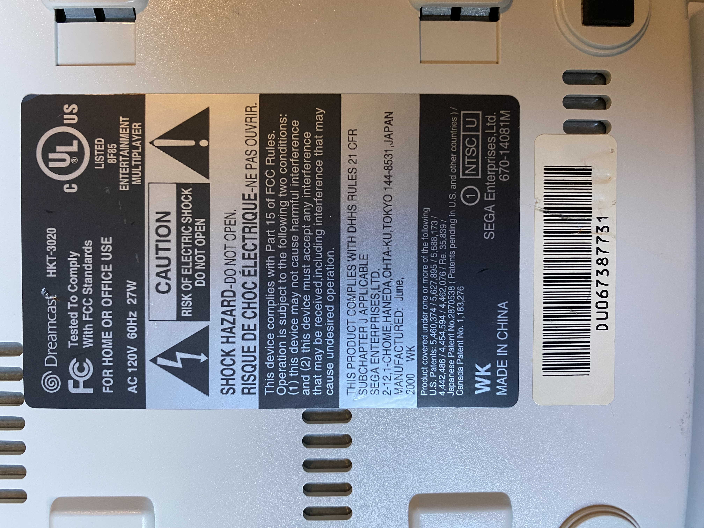
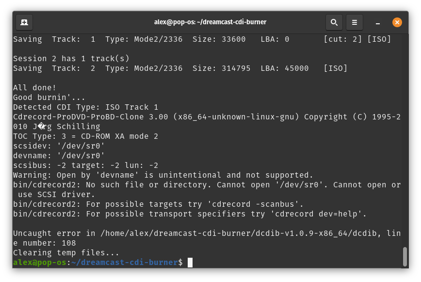

# Dreamcast CDI Burner (DCDIB) : Burn ALL Sega Dreamcast .CDI Files On Linux With Open Source Software

_by Alex Free_

 DCDIB is an open source toolkit for burning Sega Dreamcast `.cdi` files (used for self-booting homebrew programs and backups) to CD-R discs on Linux! CDI is the proprietary format of the Windows-only software DiscJuggler. CDI is a very popular format for Sega Dreamcast software distribution. The CD-Rs you burn with DCDIB will _just work_ and boot like authentic Sega Dreamcast GD-ROM discs.
 
 | [GitHub](https://github.com/alex-free/dreamcast-cdi-burner) | [Homepage](https://alex-free.github.io/dcdib) | [Dreamcast-Talk Thread](https://www.dreamcast-talk.com/forum/viewtopic.php?f=2&t=13974) |

## Table Of Contents

* [Downloads](#downloads)
* [Self-Boot Console Compatibility](#self-boot-console-compatibility)
* [CDI Compatibility](#cdi-compatibility)
* [CD-R Media](#cd-r-media)
* [Usage](#usage)
* [Building From Source](build.md)
* [License](#license)

## Downloads

### v1.1.1 (9/28/2024)

Changes:

* Added ability to test what self-boot format a CDI file is using, without burning it. This is useful to identify CDI files that are using the audio+data self-boot format, which don't work on later rev 1 Sega Dreamcast consoles. To use this feature, provide the `-c` arguemnt (i.e. `dcdib -c file.cdi`).

* Added ability to change the burn speed with an argument (i.e. 'dcdib -s 8'). The burn speed is saved to a config file, and used automatically when dcdib is ran again.

* Added ability to change the burner with an argument (i.e. 'dcdib -b /dev/sr1'). The burner is saved to a config file, and used automatically when dcdib is ran again.

* Updated [PLED](https://github.com/alex-free/pled) to the latest version 1.0.5.

* Temp file directory has been moved from `/tmp` to `/var/tmp`.

* Change to [3-BSD license](license.md) from public domain.

-------------------------------------------------------------------------------------

*   [DCDIB v1.1.1](https://github.com/alex-free/dreamcast-cdi-burner/releases/download/v1.1.1/dcdib-v1.1.1-x86_64.zip) _Portable Release For x86\_64 Linux_.

-------------------------------------------------------------------------------------

[Previous versions](changelog.md).

## CDI Compatibility

DCDIB supports burning **all 4 Sega Dreamcast CDI file format types**:

*   Data ISO (Session 1) + Data ISO (Session 2) (Data+Data method).
*   WAV/audio track (Session 1) + Data ISO (Session 2) (Audio+Data method).
*   Multiple CDDA WAVs/audio tracks (Session 1) + Data ISO (Session 2) (Audio+Data method).
*   Multiple CDDA WAVs/audio tracks in an ISO (Session 1) + Data ISO (Session 2) (Data+Data method).

 ## Self-Boot Console Compatibility

 The ability to use self-booting CDIs on an unmodified Sega Dreamcast depends on the console revision that you own. There are 2 different CDI methods, audio+data and data+data.

| Console | Can Use AUDIO+DATA Self-Boot Method? | Can DATA+DATA Self-Boot Method ?|
| --------| ---------------------------- | ------------------------------|
| Rev 0 | Yes. | Yes. |
| Early Rev 1 (September 1999 to May 2000 or possibly a bit earlier) | Yes. | Yes. |
| Late Rev 1 (June 2000 or possibly a bit earlier to October 2000 | No. | YES. |
| Rev 2 (October 2000) | No. | No. |

To find the console revision, flip the entire console upside-down and look for the number 0, 1, or 2 in a circle on the model sticker as displayed below:

Additionally, NTSC-U consoles have the date of manufacture on the label, which helps with identifying things like a late rev 1:

## CD-R Media

It is recommend to only use high-quality CD-R media with a Good CD-R Burner. My [Ultimate Guide To PSX CD-Rs](https://alex-free.github.io/psx-cdr) has a ton of info with that is also useful for Dreamcast in regards to good CD-R media and burners. The only thing specific to PSX is recommending 71 or 74 minute CD-Rs. While some CDI files can fit on lower capacity CD-Rs (i.e. 74 minutes), most CDI files target 80 minute CD-Rs. For CDI files targeting CD-R capacities larger then 80 minutes, such as 99 or 100 minute CD-Rs, be aware that not all 99 or 100 minute CD-Rs are compatible with the Dreamcast, and some burners don't even support writing that much data to a disc as it is way out of Red Book spec. Some specific brands/types of 99 and 100 minute CD-Rs DO however work, though I don't have any tests done myself yet.

If you are still having issues booting even high quality CD-Rs on the Sega Dreamcast, consider wiping with a clean microfiber cloth from the inner ring to the outer edge of the CD-R in all directions and then trying to boot the disc again.

# Usage

1) Download and unzip the latest release.

2) After inserting a high-quality CD-R disc in your CD-R burner, **ignore any prompts about the new blank CD-R** that your OS may display such as:

3) **Using sudo execute the `dcdib` script in the extracted release directory with 1 or 2 arguments**. Root privileges are required to ensure that buffer under-runs do not occur during burning which would result in a CD-R coaster. Root privileges also ensure that `cdrecord` can access your CD burner hardware successfully to burn the CD-R.

If your only using one argument, it must be the filepath to either a CDI file OR a supported compressed archive (7z/xz/cab/zip/gzip/bzip2/tar) containing a CDI file.

If your using 2 arguments:

`Usage:`

`dcdib <file>       Burn using <file> as input. <file> is either a CDI file OR a supported compressed archive (7z/xz/cab/zip/gzip/bzip2/tar) containing a CDI file.`

`dcdib -c <file>        Check the self-boot method that <file> uses, without burning. If you have a late rev 1 Sega Dreamcast that can't boot the audio+data self-boot method used by many CDI files, this option can save you from some wasted CD-Rs.`

`dcdib -s <burn speed>       Set burn speed to <burn speed> and exit.`

`dcdib -b <burner>      Set burner to <burner> (i.e. "/dev/sr0").`

Note: DCDIB provides a default CD burner config which should work on most if not all Linux distributions (`/dev/sr0`). If you find this to not work on your setup or if you have multiple drives, you can change it. You will know if you need to specify this argument because something like below will be displayed (if you a single burner that isn't at `/dev/sr0`):

## License

DCDIB itself is released as open source software under the 3-BSD license, see the file `dcdib.md` in the `licenses` directory.

DCDIB makes use of the following programs listed below, which have their own licenses/terms:

*   [PortableLinuxExecutableDirectory](https://alex-free.github.io/pled) (Public Domain, see the file `licenses/pled.txt`).

*   [CDIRip](https://github.com/jozip/cdirip) (GNU GPL v2, see the file `licenses/cdirip.txt`).

*   [CDRRecord (from CDRTools)](https://Distrotech/cdrtools) (CDDL v1.0 AND GPL v2, see the files `licenses/cdrecord-cddl.txt` and `licenses/cdrecord-gpl2.txt`).

*   [P7zip-zstd](https://github.com/p7zip-project/p7zip) (GNU LGPL with unRAR license restriction, BSD-3 Clause, and Public Domain), see `licenses/p7zip.txt`.