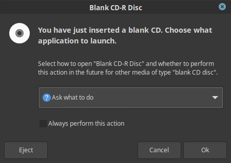
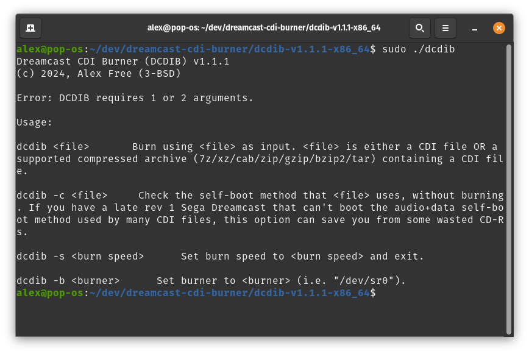
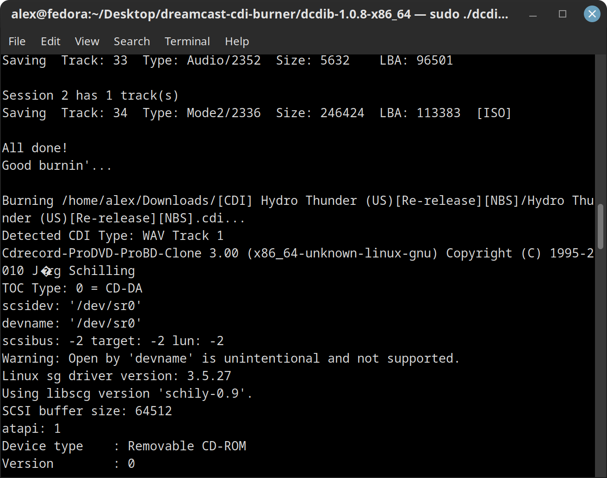

dcdib 

[alex-free.github.io](https://alex-free.github.io)
==================================================

Dreamcast CDI Burner (DCDIB) : Burn ALL Sega Dreamcast .CDI Files On Linux With Open Source Software
====================================================================================================

by Alex Free

CDI is the proprietary format of the Windows only software DiscJuggler. CDI is a very popular format for Sega Dreamcast software distribution. **DCDIB is an open source toolkit for burning Sega Dreamcast `.cdi` files (used for self-booting homebrew programs and backups) to CD-R discs on the Linux computers**. The CD-Rs you burn with DCDIB will _just work_ and boot like authentic Sega Dreamcast GD-ROM discs on revision 0 and revision 1 Sega Dreamcast consoles. **Revision 2 Sega Dreamcast consoles may or may not work with self-booting CD-Rs** due to the MIL-CD exploit being removed from the BIOS chip found on at least some revision 2 consoles. To find out what revision your Sega Dreamcast console is, flip the entire console upside-down and look for the number 0, 1, or 2 in a circle on the model sticker as displayed below:

DCDIB supports burning **all 4 Sega Dreamcast CDI file format types**:

*   Data ISO (Session 1) + Data ISO (Session 2)
*   WAV/audio track (Session 1) + Data ISO (Session 2)
*   Multiple CDDA WAVs/audio tracks (Session 1) + Data ISO (Session 2)
*   Multiple CDDA WAVs/audio tracks in an ISO (Session 1) + Data ISO (Session 2)

Links
-----

*   [GitHub](https://github.com/alex-free/dreamcast-cdi-burner)
*   [Homepage](https://alex-free.github.io/dcdib)
*   [Dreamcast-Talk Thread](https://www.dreamcast-talk.com/forum/viewtopic.php?f=2&t=13974)

Table Of Contents
-----------------

*   [Downloads](#downloads)
*   [CD-R Media & The Sega Dreamcast](#cdrmedia)
*   [Usage](#usage)
*   [Installing From Source](#source)
*   [Bundled Software & Licensing](#bundled)

Downloads
---------

### v1.0.8 (9/28/2022)

*   [DCDIB v1.0.8](https://github.com/alex-free/dreamcast-cdi-burner/releases/download/v1.0.8/dcdib-1.0.8-x86_64.zip) _For modern x86\_64 Linux distributions_.

Changes:

*   Portable/self-contained Linux releases are now generated by the source tree (using [PLED](https://alex-free.github.io/pled)) that work on modern x86\_64 Linux distributions.
*   Added an optional second argument that can be passed to DCDIB to allow a user specified CD burner device devname.
*   Added default CD burner device devname for cdrecord to the `dcdib` script (thanks [Tomodachi](https://github.com/tomodachi)).
*   Added [CDRTools](https://github.com/Distrotech/cdrtools) and [CDIRip](https://github.com/jozip/cdirip) as proper submodules in source tree.
*   Completely rewrote the new `build` script for compiling portable Linux releases.
*   Added sanity checks to the `dcdib` script (thanks [hackerb9](https://github.com/hackerb9)).
*   Dropped Mac OS/Mac OS X/\*BSD support.

CD-R Media & The Sega Dreamcast
-------------------------------

Only use high-quality CD-R media. If you want good results burning backups for your Sega Dreamcast your CD-R media should contain:

*   High quality dye (SuperAZO, AZO, or Phthalocyanine).
*   A highly reflective layer system.
*   High quality polycarbonate and "sealing" process combining all parts of the CD-R.

I have found Verbatim DataLifePlus CD-Rs to be really good with Sega Dreamcast consoles. For reference, below is the ATIP information displayed by `cdrecord -atip` for a Verbatim DataLifePlus CD-R:

    ATIP info from disk:
      Indicated writing power: 4
    Disk Is not unrestricted
    Disk Is not erasable
      Disk sub type: Medium Type A, high Beta category (A+) (3)
      ATIP start of lead in:  -11077 (97:34/23)
      ATIP start of lead out: 359848 (79:59/73)
    Disk type:    Long strategy type (Cyanine, AZO or similar)
    Manuf. index: 11
    Manufacturer: Mitsubishi Chemical Corporation

Verbatim UltraLife Archival Grade Gold CD-Rs also are really good, although they are more expensive then Verbatim DataLifePlus. I think Verbatim DataLifePlus CD-Rs are slightly better with the Sega Dreamcast anyways, but they remain an excellent option. For reference, below is the ATIP information displayed by `cdrecord -atip` for a Verbatim UltraLifePlus CD-R:

    ATIP info from disk:
      Indicated writing power: 5
    Disk Is not unrestricted
    Disk Is not erasable
      Disk sub type: Medium Type B, low Beta category (B-) (4)
      ATIP start of lead in:  -12520 (97:15/05)
      ATIP start of lead out: 359849 (79:59/74)
    Disk type:    Short strategy type (Phthalocyanine or similar)
    Manuf. index: 26
    Manufacturer: TDK Corporation

Do not use cheap/poor quality CD-R media, which is almost always all that is available in retail stores and most likely any CD-R that is not "archival grade". _Poor quality cheap CD-R media can sometimes result in:_

*   Slower loading times/in-game lag because of CD drive tracking errors.
*   Issues reading data off of the disc possibly resulting in failure to boot the CD-R entirely.
*   Skipping/silent audio and or music.

Poor quality CD-R media _may_ work fine with the Sega Dreamcast and you may not experience the above issues, however in general it is still best to just always use Verbatim DataLifePlus/UltraLife CD-Rs or something of similar quality. For reference, below is the ATIP information displayed by `cdrecord -atip` for a Maxell Music CD-R:

    ATIP info from disk:
      Indicated writing power: 4
    Disk Is unrestricted
    Disk Is not erasable
      Disk sub type: Medium Type A, low Beta category (A-) (2)
      ATIP start of lead in:  -12508 (97:15/17)
      ATIP start of lead out: 359845 (79:59/70)
    Disk type:    Short strategy type (Phthalocyanine or similar)
    Manuf. index: 22
    Manufacturer: Ritek Co.

If you are still having issues booting even high quality CD-Rs on the Sega Dreamcast, consider wiping with a clean microfiber cloth from the inner ring to the outer edge of the CD-R in all directions and then trying to boot the disc again.

Usage
-----

DCDIB released as a portable Linux application (generated by [PortableLinuxExecutableDirectory](https://alex-free.github.io/pled)), so **if you have a modern x86\_64 Linux OS you can simply download and unzip the latest DCDIB release to use it**. If you desire to use DCDIB on a different Linux OS version and or architecture then what the current release provides support for, you may compile DCDIB from [source](#source). After inserting a high-quality CD-R disc in your CD-R burner, **ignore any prompts about the new blank CD-R** that your OS may display such as:

**Using sudo or root, execute the `dcdib` script in the extracted release directory with 1 or 2 arguments**. The first argument is the filepath to the `.cdi` file you want to burn to a CD-R and it is required. The second argument is completely optional, it allows you to change the CD burner's device devname to a custom one. DCDIB already provides a default CD burner device devname to use which should work on most if not all Linux distributions (`/dev/sr0`). However if you find this to not work on your setup you can provide your own in the optional second argument to DCDIB.

_If your wondering why_, root privileges are required to ensure that buffer under-runs do not occur during burning which would result in a CD-R coaster. Root privilages also ensure that `cdrecord` can access your CD burner hardware successfully to burn the CD-R.

Installing From Source
----------------------

Installing from source allows you to compile your own DCDIB release for a different Linux version, distribution, and or CPU architecture (i.e. ARM, x86 32-bit, etc.).

First of all, install all the pre-requisites required for building DCDIB from source:

*   [GNUmake](https://www.gnu.org/software/make/)
*   [GCC](https://www.gnu.org/software/gcc)
*   [Bash](https://www.gnu.org/software/bash)
*   [Git](https://git-scm.com/)

Next, clone the DCDIB source tree from GitHub recursively using git:

    git clone --recursive https://github.com/alex-free/dreamcast-cdi-burner

Now that the entire DCDIB source tree is recursively cloned, `cd` into the `dreamcast-cdi-burner` directory and execute the `./build` script. Then just wait a bit for your release `.zip` file to be generated by the `build` script. A release directory will also be created, allowing you to immediately use the DCDIB open source toolkit.

If you want to clean your DCDIB source tree of all built binaries/releases, simply execute `./build clean`. The `clean` argument will tell the `build` script to simply exit after resetting the source tree.

Bundled Software & Licensing
----------------------------

DCDIB itself is released into the public domain, see the file `dcdib.txt` in the `licenses` directory of each DCDIB release.

DCDIB makes use of the following programs listed below, which have their own licenses/terms:

*   [PortableLinuxExecutableDirectory](https://alex-free.github.io/pled) (Public Domain, see the file `licenses/pled.txt`)
*   [CDIRip](https://github.com/jozip/cdirip) (GNU GPL v2, see the file `licenses/cdirip.txt`)
*   [CDRRecord (from CDRTools)](https://Distrotech/cdrtools) (CDDL v1.0 AND GPL v2, see the files `licenses/cdrecord-cddl.txt` and `licenses/cdrecord-gpl2.txt`)